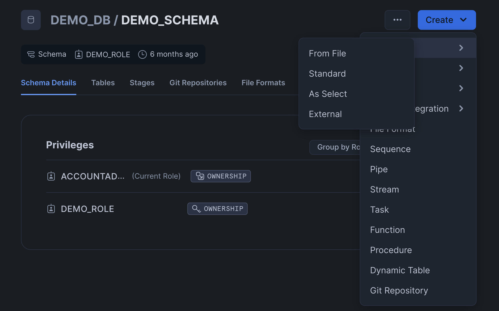
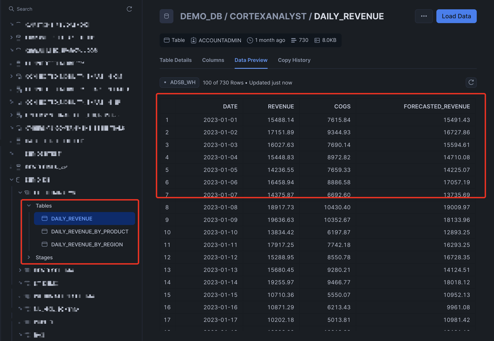
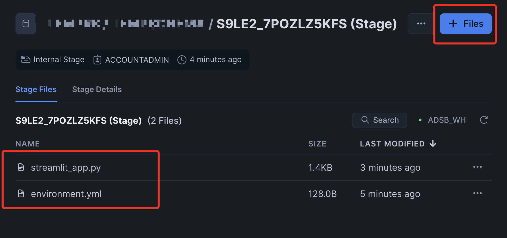

# Build text2sql bot using Cortex Complete & Streamlit
### Introduction
The goal of this project is to provide an easy alternative using Streamlit & cortex complete function to build text2SQL for your structured data. Prompt engineering and schema file is crucial for interacting with your structured data using natural language.

### What is Cortex Complete?
Cortex Complete is a function in Snowflake Cortex that uses large language models (LLMs) to support a variety of use cases. It offers multiple models that differ in cost, latency, and capability. The best model to use depends on the complexity and size of the task, and the goal is to get the best performance per credit. Snowflake makes it easy to run LLM functions using SQL query. Ex of running mistral-large using cortex complete function. 
```
SELECT SNOWFLAKE.CORTEX.COMPLETE('mistral-large', 'What are large language models?');
```
You can build and run this solution in less than 10 minutes. If you do not have snowflake account you can create 30 days trial from [here](https://signup.snowflake.com/?utm_source=google&utm_medium=paidsearch&utm_campaign=na-us-en-brand-datawarehouse-phrase&utm_content=go-rsa-evg-ss-free-trial&utm_term=c-g-snowflake%20data%20warehousing-p&_bt=586482103656&_bk=snowflake%20data%20warehousing&_bm=p&_bn=g&_bg=136172945468&gclsrc=aw.ds&gad_source=1&gclid=CjwKCAjwufq2BhAmEiwAnZqw8oBQyJbY3XqegFk4xZjwsWl8MgoQcqBv-M80FMnFm2InebyAcdFITxoCas0QAvD_BwE)
### Steps to create test data
1. Login to snowflake account and <b>Head over to Data</b>. Click on <b>+ Database</b> button from top right of the screen. Provide the database name "DEMO_DB" and click Create button.
2. Click on <b>DEMO_DB</b> database to shows database details. Click on <b>+ Schema </b> button from top right of the screen. Provide the schema name "DEMO_SCHEMA" and click Create button.
3. Lets create table and load test files. Three csv files are provided in data folder for you to load 3 tables. Click on Schema name and from top right click on Create button dropdown and select "From File" option. .
4. This will open popup to browse the csv file. Select each file from data folder and provide name of the table as file name without extension.
5. Follow the same process for all 3 files.
6. This completes test data and you should have the tables like this with test data loaded.
7. <b>Head over to Projects</b> and click on Streamlit. From top right of the screen click on <b>+ Streamlit App </b> button to build new streamlit app. 
8. Choose App title, App location as your newly created database and schema name and select any xsmall warehouse that you have for your user. If you do not have warehouse follow [here](https://docs.snowflake.com/en/user-guide/warehouses-tasks) to create one. 
9. Once the app is created, remove all python code from app editor and paste the code from salesbot.py.
10. Head over again to Data/Database and select database and schema, you will see Stages under your schema name. Click on the Stage name & <b>Enable Directory Table </b> from right side. This will show recently created streamlit_app.py & environment.yaml file. Upload "schema.txt" file from project to this location.
11. Head over to Projects/Streamlit and click on newly created streamlit app. This should open streamlit app with Sales Bot.

This completes the installation, now you can interact with your data using natural language. Some of the sample question you can ask

```
1. Show me unique products?
2. show me top product revenue by region?
3. show me top 3 product by revenue?
4. show me total revenue for Books for Asia region?
5. What is the revenue for Electronics in 2023?
6. What is the revenue for Books in 2023 for North America region?
```

Note: This is simple solution to build virtual agent to interact with your structured data. If you would like to build more accurate version using semantic model you can look into Cortex Analyst [here](https://quickstarts.snowflake.com/guide/getting_started_with_cortex_analyst/index.html#0).